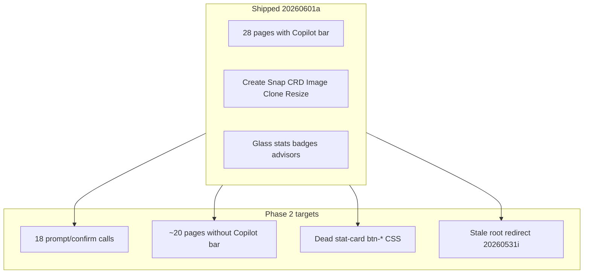

<!-- 52a99a8d-d12f-40ee-97e9-5520b8a58ca6 -->
---
todos:
  - id: "dialog-primitives"
    content: "Add openGlassConfirm/openGlassPrompt helpers + shared modal HTML; wire Escape/backdrop"
    status: pending
  - id: "confirm-migration"
    content: "Migrate 7 confirm() call sites (delete VM/snap/schedule, bulk delete, migrate, blueprint) to glass confirm"
    status: pending
  - id: "prompt-migration"
    content: "Migrate 11 prompt() flows (Blueprint save, GitOps export, Blueprint Studio, Catalog VMTemplate/VMProfile) to glass prompt modal"
    status: pending
  - id: "copilot-compute-network"
    content: "Add Copilot bars + stat pills to VMs, HPA, Ingress, Network Policies, Images, Topology, Dependencies, Autoscaler, Cilium"
    status: pending
  - id: "copilot-platform-admin"
    content: "Add Copilot bars + stat pills to CRDs, Blueprint Studio, Policies, Actions, Notifications, Helm, Operators, Custom Resources, Chaos, RBAC, App Store, Custom Dashboards"
    status: pending
  - id: "css-redirect-cleanup"
    content: "Remove dead stat-card/btn-* CSS; fix http_server.rs root redirect; final zinc/steel QA; bump DASH_REV to 20260601f"
    status: pending
isProject: false
---
# Veyron Liquid Glass Big Sweep — Phase 2

## Git status

**Nothing to commit or push** — `main` is clean at `f9e32d79` (`20260601a`), already on `origin/main`.

---

## Context

Phase 1 ([Liquid Glass Big Sweep-52a99a8d.plan.md](Liquid Glass Big Sweep-52a99a8d.plan.md)) shipped Copilot bars + glass stats on ~28 routes, global modals for create/snap/CRD/image-import, and shell closure (clone modal, operator panel). **Phase 2** targets the remaining UX debt that still breaks the premium Liquid Glass feel.

**Constraints:** single-file SPA in [`src/api/web/dashboard.html`](src/api/web/dashboard.html) (~10.8k lines); minimal Rust touch for redirect only; no new API routes.



---

## Workstream 0: Shared dialog primitives (do first)

Add near existing helpers (~line 9900) in [`dashboard.html`](src/api/web/dashboard.html):

| Helper | Purpose |
|--------|---------|
| `openGlassConfirm({ title, body, confirmLabel, destructive, onConfirm })` | Replaces all `confirm()` — glass modal with primary/destructive button |
| `openGlassPrompt({ title, fields[], onSubmit })` | Replaces multi-field `prompt()` chains — reusable form modal |
| `wireGlassModalEscape(id, closeFn)` | Backdrop click + Escape (match clone/resize pattern) |

**HTML:** one `#glass-confirm-modal` and one `#glass-prompt-modal` in the modals section (after `#clone-modal`).

This avoids 18 copy-pasted modal blocks.

---

## Workstream 1: Native dialog elimination

### `confirm()` → glass confirm (7 call sites)

| Location | Action |
|----------|--------|
| `deleteVM` (~5418) | Destructive confirm |
| `deleteSchedule` (~6768) | Destructive confirm |
| `deleteSnapshot` / `restoreSnapshot` (~8284, 8293) | Destructive + warning copy |
| `migrateVM` (~8715) | Standard confirm |
| `bulkAction('delete')` (~8749) | Destructive with count |
| `deleteBlueprint` (~8968) | Destructive confirm |

### `prompt()` → glass prompt (11 call sites)

| Flow | Fields |
|------|--------|
| Blueprint save (~6112–6113) | description, optional name |
| GitOps export (~6140–6141) | app folder name, namespace |
| Blueprint Studio create (~8921–8923) | name, template |
| Catalog VMTemplate create (~10674–10678) | CRD name, embedded template, description |
| Catalog VMProfile create (~10691–10700) | name, optional copy-from, or cores/memory/disk |

Clone VM already uses glass modal — use as reference.

---

## Workstream 2: Copilot coverage gap (~20 pages)

**Already have** `page-copilot-bar`: Snapshots, Nodes, Pods, Storage, Events, Insights, Costs, Security, Monitoring, Workloads, Alerts, Audit, SLO, Quotas, Backups, Catalog, Integrations, Metrics, Forecasting, GitOps, Scheduling, Observability, Performance, Webhooks, Compliance, DR, Heatmap, Traces, Logs, Incidents.

**Missing Copilot bar** — add standard template + `wirePageCopilot`:

| Page | Suggested default query / chips |
|------|----------------------------------|
| **VMs** (`#page-vms`) | Fleet health; chips: Unhealthy, Drift, Pending |
| **CRDs** | Operator VM posture |
| **Blueprint Studio** | Blueprint drift / export |
| **Policies** | Compliance violations |
| **Actions** | Pending approvals |
| **Notifications** | Unread / critical |
| **Helm** | Failed releases |
| **Operators** | Unhealthy operators |
| **Custom Resources** | CR instance counts |
| **Chaos** | Active experiments |
| **RBAC** | Overprivileged bindings |
| **Ingress** | Missing TLS |
| **HPA** | Scaled-to-zero |
| **App Store** | Template pick help |
| **Topology** | Network paths |
| **Dependencies** | Blocked deps |
| **Autoscaler** | Pending scale |
| **Custom Dashboards** | Grafana links |
| **Network Policies** | Default-deny gaps |
| **Images** | Import / CDI status |
| **Cilium** | Already has Advisor button — **add Copilot bar** below header (keep Advisor) for parity |

Also add **glass stat pills** on pages that still render tables only (Helm, Operators, CRs, Policies, Actions, Notifications, RBAC, Ingress, HPA, Topology, Dependencies, Autoscaler, Custom Dashboards) where `fetch*` can derive counts from existing list responses.

**Page template:**

```html
<div class="page-header">…</div>
<div class="dc-copilot-bar glass-card-hero page-copilot-bar">…</div>
<div id="*-summary" class="grid-4 page-glass-stats"></div>
<div class="card glass-card">…</div>
```

---

## Workstream 3: CSS debt cleanup

Remove or alias legacy rules no longer emitted by JS:

- `.stat-card` and color variants (~lines 574–617, 916–921, theme overrides 1788–1957) — **zero JS callers** after Phase 1
- `.btn-start` / `.btn-stop` / `.btn-restart` (~821–832) — unused in markup
- `.btn-forge` (~1099–1108) — catalog migrated; keep only if still referenced
- Narrow `.btn-create` to layout-only (min-width in `.command-actions`) since all instances pair with `glass-btn-primary`

**Keep:** `.chart-card`, `.resource-bar`, `.operator-details` (already glass).

Run a quick grep after deletion to ensure no broken selectors.

---

## Workstream 4: Backend redirect fix

[`src/api/http_server.rs`](src/api/http_server.rs) line 1080:

```rust
Redirect::permanent("/dashboard?dash=20260531i")  // stale
```

Change to `/dashboard?dash=20260601f` **or** `/dashboard` only (let client-side `DASH_REV` / sessionStorage handle cache bust). Prefer dropping the query param to avoid perpetual drift.

**One-line Rust change** — bump together with final dashboard rev in Phase 2.

---

## Workstream 5: Interaction polish (cross-cutting)

- **VMs page:** summary pills from fleet counts (running/stopped/issues) using `renderGlassStatPills` + clickable filters
- **Confirm modals:** focus trap + auto-focus primary field on prompt modals
- **Theme QA:** zinc/steel pass on new confirm/prompt modals
- **Advisor ID audit:** ensure no duplicate advisor card IDs when adding Copilot to Policies/Actions/etc.

---

## Execution order (recommended commits)

| Step | Scope | Rev bump |
|------|-------|----------|
| 1 | Dialog primitives + confirm() migration | `20260601b` |
| 2 | prompt() migration (Blueprint, GitOps, Catalog) | `20260601c` |
| 3 | Copilot gap — compute/network (VMs, HPA, Ingress, NetPol, Images, Cilium) | `20260601d` |
| 4 | Copilot gap — platform/admin (Helm, Operators, CRs, RBAC, Blueprint, CRDs, App Store) | `20260601e` |
| 5 | CSS cleanup + root redirect + final theme QA | `20260601f` |

Each commit should be shippable independently. Full deploy only needed after HTML/Rust changes (not `--quick` alone).

---

## Verification checklist

- Hard-refresh: `?dash=<rev>` after deploy to `HOST`
- **Dialogs:** delete VM, bulk delete, snapshot restore, blueprint create, GitOps export, catalog CRD create — all use glass modals (no native prompt/confirm)
- **Copilot:** Ask from each newly wired page opens slide-over
- **Deep links:** `#vms/ns/name`, `#pods/ns/name`, `#nodes/name` unchanged
- **Root:** `GET /` redirects to current dashboard rev
- **Themes:** zinc + steel on new modals
- **CI:** `make ci` (Rust redirect change only)

---

## Out of scope

- React/Tailwind migration or splitting `dashboard.html`
- PacketWolf-style sidebar / three-mode shell (cancelled)
- New backend APIs or advisor backends
- Editing the Phase 1 plan file (reference only)
