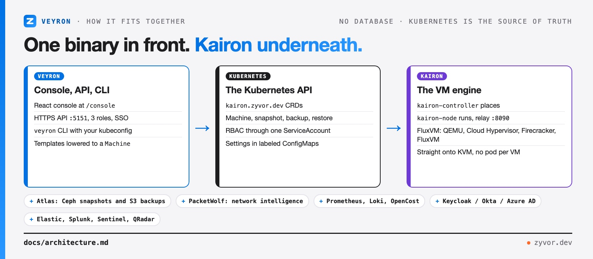

<div align="center">

# Veyron

[](https://github.com/zyvorai/veyron/actions/workflows/ci.yml)
[](LICENSE)
[](Cargo.toml)
[](https://github.com/zyvorai/kairon)

[](https://zyvor.dev/schedule?utm_source=github&utm_medium=veyron&utm_campaign=readme_hero)
[](https://zyvor.dev/poc?utm_source=github&utm_medium=veyron&utm_campaign=readme_hero)
[](#quickstart)


### Every VM on Kubernetes. One console.

**Veyron is the command center for virtual machines on Kubernetes.** Create, run, protect and secure VMs from a browser, an HTTPS API or a CLI, all in one Rust binary, with [Kairon](https://github.com/zyvorai/kairon) running the VMs underneath.

**Browser console** · **Day-2 operations built in** · **GPU and Windows ready** · **SSO and three-role RBAC** · **A SOC that watches your fleet**

</div>

---

## What's new

| | |
|---|---|
| **Kairon as the engine** | Veyron drives Kairon `Machine`s through the Kubernetes API: no pod per VM, no libvirt in the hot path. KubeVirt and CDI are on the way out. |
| **A new console** | Login, buttons, colors and every panel rebuilt in the Zyvor design system, in light and dark. |
| **Source-available** | The full source is public under the [Zyvor Production License](LICENSE): free for evaluation and non-production use. |

---

## Why Veyron

| When this happens… | Veyron gives you… |
|---|---|
| Your team needs VMs but nobody wants to hand-write YAML | **Templates and a console.** Current OS templates (Ubuntu 26.04, Debian 13, Fedora 44, EL10, Windows Server 2025 and 11), size and start a VM in a minute, then open its screen in the browser. |
| Day 2 means a pile of scripts: patching, resizing, moving, cleaning up | **Day-2 operations as buttons and API calls:** hotplug, bulk actions, node maintenance, guest patching, disk reclaim, self-healing. |
| A bad upgrade or a deleted disk turns into an outage | **Snapshots, clones, backups and DR failback**, plus Ceph snapshots and off-cluster S3 backups through [Atlas](https://zyvor.dev). |
| GPU and Windows workloads don't fit generic tooling | **GPU passthrough with a live-migration guard**, and Windows golden images with sysprep, domain join and RDP guardrails. |
| Everyone shares one admin password | **Admin, write and read-only roles**, multiple keys, local accounts and OIDC SSO with Keycloak, Okta, Auth0 or Azure AD. |
| Security finds exposed VMs after the fact | **A built-in SOC:** detections for public RDP and SSH, policy gaps and drift, plus export to Elastic, Splunk, Sentinel and QRadar. |


---

## See it

| Mission Control | Virtual machines |
|---|---|
|  |  |
| **Sign in** | **Dark theme** |
|  |  |

---

## How it fits together



Veyron keeps no database. VM state lives in Kubernetes as Kairon custom resources, and Veyron's own settings (alert rules, policies, budgets, SOC state) live in labeled ConfigMaps. Consoles and in-guest commands go through the kairon-node relay, so there is nothing per VM to babysit. Anything the engine can't do returns `501` with a reason, never a fake success. Details: [docs/architecture.md](docs/architecture.md).

---

## Quickstart

On a Kubernetes cluster whose VM hosts run [Kairon](https://github.com/zyvorai/kairon):

```bash
git clone https://github.com/zyvorai/veyron.git && cd veyron
./scripts/deploy-remote.sh <node-host> <ssh-user>     # build on the node, deploy to veyron-system
```

Open `https://<node-ip>:30151/console` and sign in. Then create a VM from the console, the API or the CLI:

```bash
curl -sk -H "X-API-Key: $VEYRON_API_KEY" -H 'Content-Type: application/json' \
  -X POST https://<node-ip>:30151/api/v1/vms \
  -d '{"name":"demo","template":"ubuntu-24.04","cpus":2,"memory":"4Gi"}'

veyron create demo --template ubuntu-24.04 --cpus 2 --memory 4Gi
```

Helm, plain manifests, the production checklist and the standalone client tarball are covered in [docs/deploy.md](docs/deploy.md). The first VM, end to end: [docs/getting-started.md](docs/getting-started.md).

---

## Maturity

| Area | Status |
|---|---|
| VM lifecycle, templates, browser console | Stable |
| Snapshots, clones, backups, Velero | Stable |
| Day-2 operations (hotplug, bulk, guest patching, self-healing) | Stable |
| API keys, roles, local accounts | Stable |
| OIDC SSO | API stable; console sign-in button planned |
| SOC detections and SIEM export | Stable |
| GPU passthrough | Phase 1 (whole-GPU); vGPU next |
| Atlas (Ceph) protection, Kryton lab machines, PacketWolf | Integration, needs those products |
| Kairon engine | In progress: replacing KubeVirt and CDI |

---

## Docs

| Goal | Document |
|---|---|
| Getting started | [docs/getting-started.md](docs/getting-started.md) |
| Architecture | [docs/architecture.md](docs/architecture.md) |
| Deploy and production checklist | [docs/deploy.md](docs/deploy.md) |
| API, roles and keys | [docs/api.md](docs/api.md) |
| Single sign-on | [docs/sso.md](docs/sso.md) |
| GPU · Windows · multi-site | [docs/gpu.md](docs/gpu.md) · [docs/windows.md](docs/windows.md) · [docs/multi-site.md](docs/multi-site.md) |
| SOC and integrations | [docs/soc.md](docs/soc.md) · [docs/integrations.md](docs/integrations.md) |

## Develop

```bash
make ci                                 # fmt check, clippy, tests (RUST_MIN_STACK is set for you)
cd frontend && npm install && npm run dev   # console against a local API on :5151
```

Start with [CONTRIBUTING.md](CONTRIBUTING.md). Report vulnerabilities privately to **security@zyvor.dev**; see [SECURITY.md](SECURITY.md).

---

## Part of the Zyvor stack

| Product | Role next to Veyron |
|---|---|
| **Veyron** | The console, API and CLI for VMs on Kubernetes |
| **[Kairon](https://github.com/zyvorai/kairon)** | The VM engine: `Machine`s on FluxVM and KVM, without KubeVirt |
| **[Kryton](https://github.com/zyvorai/zyvor-kryton)** | Machine API for lab and edge Windows/Linux hosts (dockur, libvirt), plus checksum-pinned golden images |
| **[Atlas](https://github.com/zyvorai/zyvor-atlas)** | Storage control plane: Ceph snapshots, clones and S3 backups for VM disks |
| **PacketWolf** | Network intelligence for the cluster |
| **[GuestKit](https://github.com/zyvorai/zyvor-guestkit)** | In-guest agent: evidence, diagnosis and repair |

→ [zyvor.dev](https://zyvor.dev)

---

## License

Veyron is source-available under the **[Zyvor Production License v1.0](LICENSE)** (SPDX `LicenseRef-Zyvor-Production-1.0`, also in [LICENSES/](LICENSES/LicenseRef-Zyvor-Production-1.0.txt); see [NOTICE](NOTICE)).

- **Free** for evaluation, development, testing, proofs of concept, research, education and all other non-production use.
- **Production use needs a commercial license** from Zyvor AI Labs. That covers production clusters, customer workloads, SaaS, managed services, OEM and redistribution, with support options to match.

Talk to us: [sales@zyvor.dev](mailto:sales@zyvor.dev?subject=Veyron) · [zyvor.dev](https://zyvor.dev). Bugs and feature requests: [GitHub Issues](https://github.com/zyvorai/veyron/issues).

---

<div align="center">

### Run your VM fleet from one place.

[](https://zyvor.dev/schedule?utm_source=github&utm_medium=veyron&utm_campaign=readme_footer)
[](https://zyvor.dev/poc?utm_source=github&utm_medium=veyron&utm_campaign=readme_footer)
[](mailto:sales@zyvor.dev?subject=Veyron)
[](https://github.com/zyvorai/veyron)

</div>
