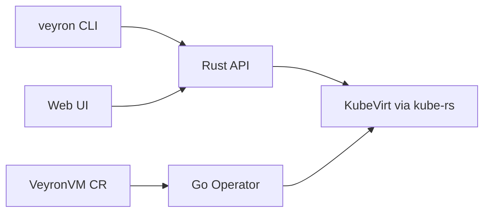

# Veyron

**Kubernetes-native VM command center.**


## 📖 Feature Guide

**[Veyron — Customer Feature Guide](docs/veyron-customer-feature-guide.md)** — a complete, customer-facing reference covering all **58 features** across **12 areas**, grounded in the product's actual capabilities. Also available as a print-ready **[PDF](docs/veyron-customer-feature-guide.pdf)**.

**[Customer manual (page-by-page)](docs/customer/README.md)** — getting started, admin basics, and a guide for every Mission Control page (PDFs under `docs/customer/pdf/`).

Rogue VM management for **KubeVirt** — forged in Rust. Declarative VM builder, 44 OS templates, multi-VM blueprints, browser VNC console, GitOps export, policy enforcement, and a Mission Control web dashboard with 40+ advanced pages.

```text
┌──────────────────────────────────────────────────────────────┐
│  Surfaces     CLI · TUI · Web dashboard · REST API (49 routes)│
├──────────────────────────────────────────────────────────────┤
│  GitOps       VeyronVM CRD · Go operator · Helm charts       │
├──────────────────────────────────────────────────────────────┤
│  KubeVirt     VirtualMachine lifecycle · snapshots · migrate │
└──────────────────────────────────────────────────────────────┘
```

> Local folder may be named `Veyron` · GitHub repo: **Veyron**

---

## Why Veyron

| Problem | Veyron answer |
|---------|---------------|
| KubeVirt YAML is verbose and error-prone | Templates, validation, blueprints |
| No unified VM dashboard | Mission Control + Fleet Command + ConsoleHub |
| GitOps needs CR-native VMs | VeyronVM operator + `veyron gitops-export` |
| Console via virtctl times out | Direct K8s WebSocket VNC |
| Policy violations slip through | VeyronPolicy CRDs with CEL deny rules |

---

## Platform at a Glance

| Layer | What's in the repo |
|-------|-------------------|
| **Rust core** | CLI, library, API server — `src/` |
| **Operator** | Go controller-runtime — `operator/` |
| **Web** | React dashboard — `web/` |
| **Templates** | 44 OS images + 8 resource profiles |
| **Blueprints** | LAMP, K8s, 3-tier, CI/CD stacks |
| **Terraform** | Provider — `terraform-provider-veyron/` |

---

## Quick Start

```bash
git clone https://github.com/ssahani/Veyron.git && cd Veyron
cargo build --release

# Create VM from template
./target/release/veyron create --template ubuntu-22.04 --name web-01

# Deploy blueprint stack
./target/release/veyron blueprint deploy lamp --namespace dev

# Web dashboard + API
./target/release/veyron serve
# → https://localhost:8080

# GitOps export
./target/release/veyron gitops-export --namespace production -o manifests/
```

| Scenario | Path |
|----------|------|
| Operator deploy | `charts/veyron-operator/` |
| Remote deploy | `./scripts/deploy-remote.sh` |
| GuestKit integration | `guestkit/` submodule · [`veyron agent deploy`](docs/GUESTKIT_AGENT.md) |

---

## Architecture



---

## Documentation

| Goal | Document |
|------|----------|
| Docs index | [docs/README.md](docs/README.md) |
| User stories | [docs/USER_STORIES.md](docs/USER_STORIES.md) |
| GPU cloud roadmap (passthrough → vGPU) | [docs/NEO_CLOUD_GPU_ROADMAP.md](docs/NEO_CLOUD_GPU_ROADMAP.md) |
| OpenAPI | Embedded in API server |

## Zyvor Platform Stack

| Product | Role |
|---------|------|
| **hypercluster** | Bare-metal Kubernetes bootstrap |
| **machina** | Physical hypervisor OS (libvirt/KVM) |
| **zeus-os** | Cloud / KubeVirt control plane |
| **hermes** | Application layer for Kubernetes |
| **forge** | AI infrastructure on Kubernetes |
| **hypersdk / hyper2kvm** | Multi-cloud VM migration |
| **guestkit** | Offline VM migration assurance |
| **packetwolf** | Kernel-native network intelligence |
| **Aether** | Universal runtime portability |
| **Veyron** | KubeVirt VM command center |
| **IronWolf** | Metal3 bare-metal automation |
| **zyvor-fabric** | systemd-native private cloud |

→ [zyvor.dev](https://zyvor.dev)

---

## Development

See project docs for CI, testing, and contribution guidelines. Historical build summaries in the repo root are snapshots — **`docs/` and this README are authoritative.**

---

## License

See [LICENSE](LICENSE) or project-specific licensing files in `docs/legal/`.
