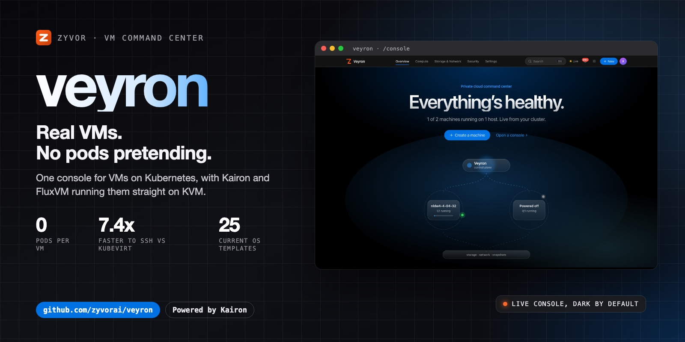
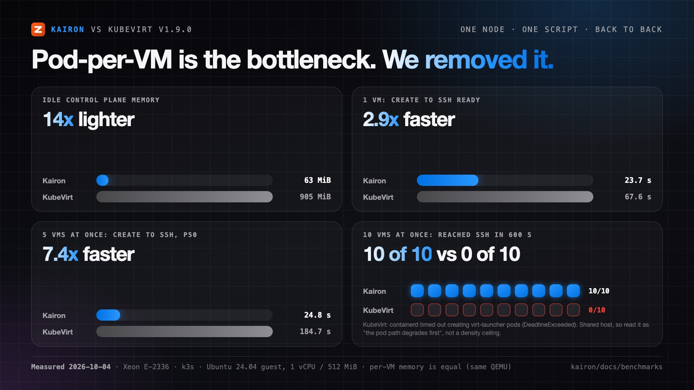
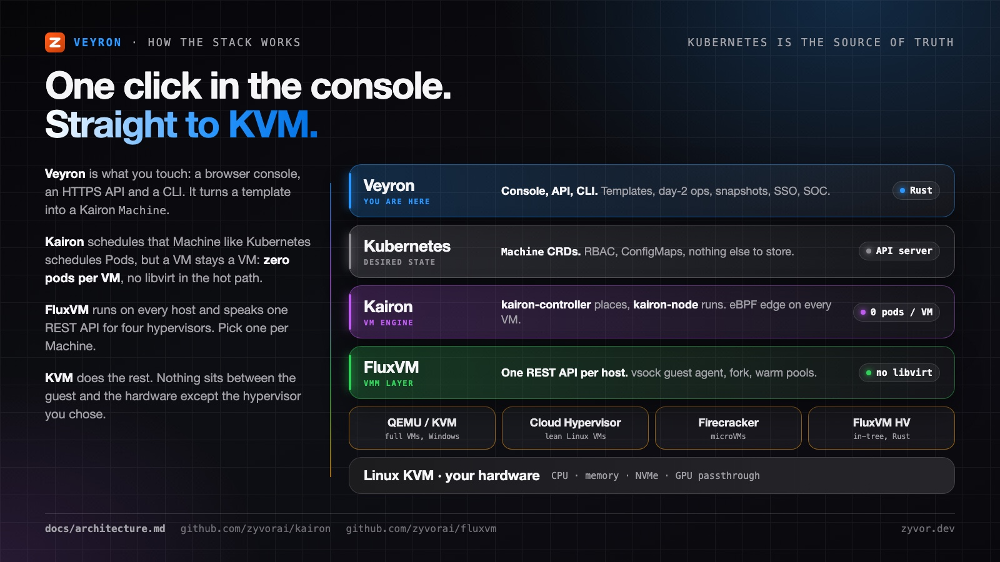
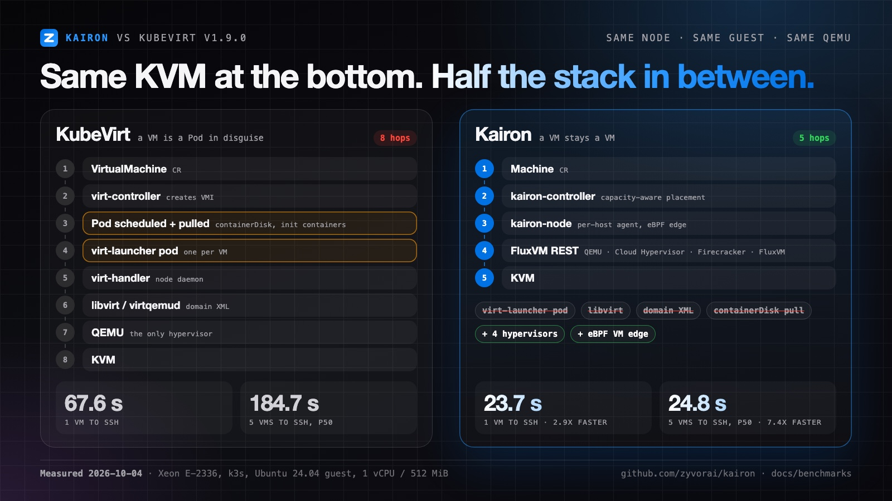
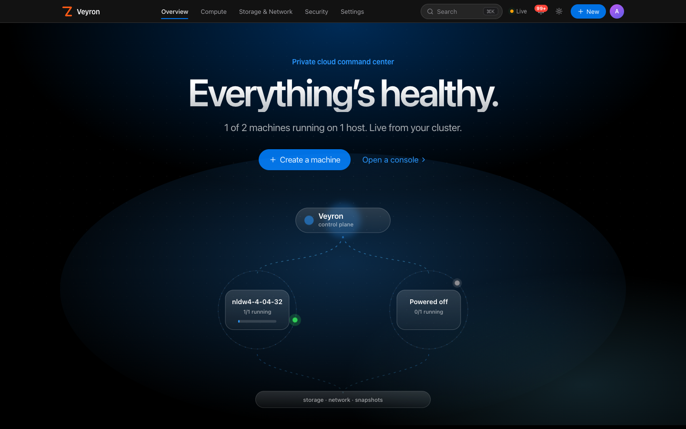
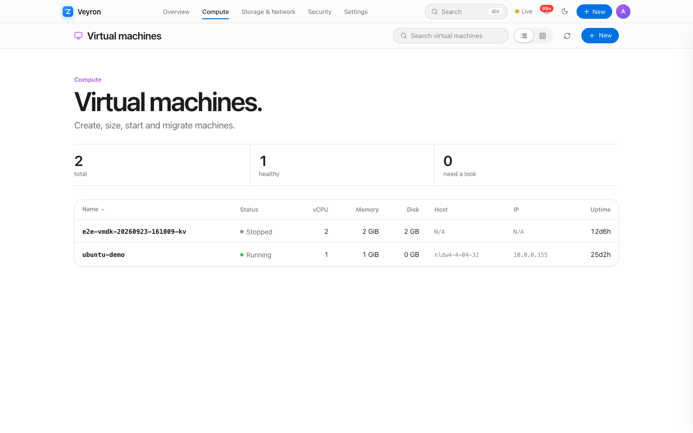
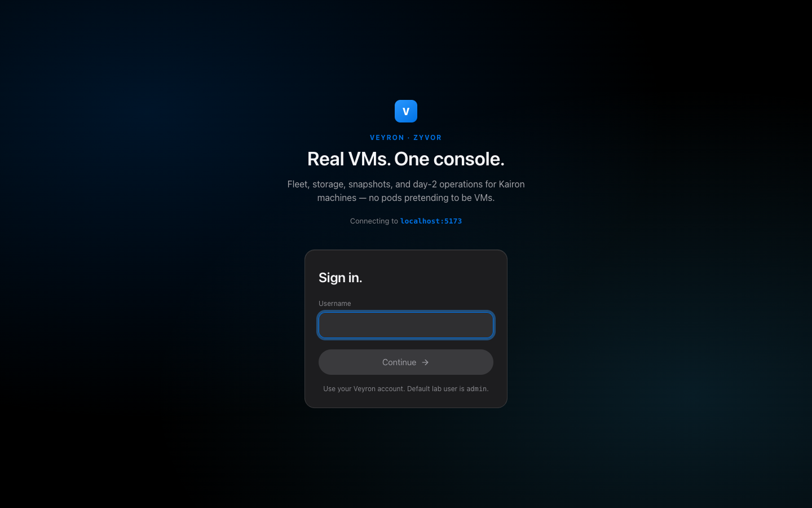
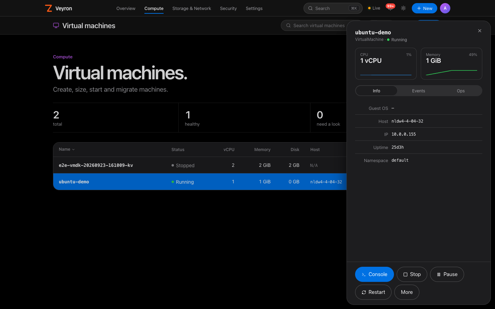
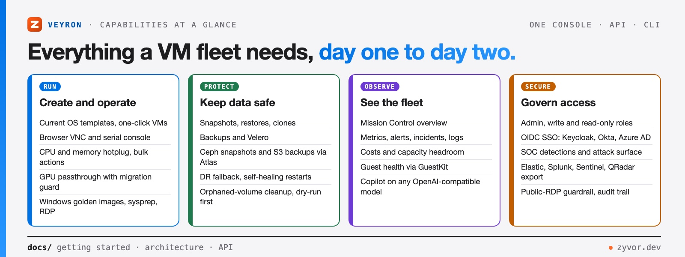
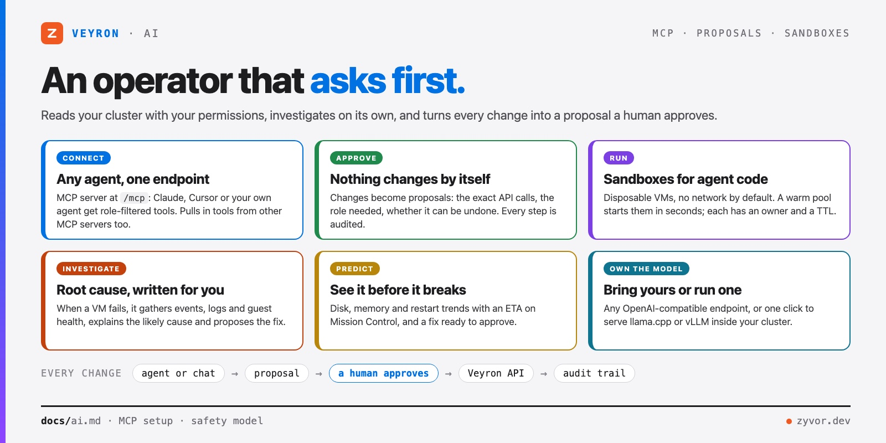

<div align="center">

# Veyron

[](https://github.com/zyvorai/veyron/actions/workflows/ci.yml)
[](LICENSE)
[](Cargo.toml)
[](https://github.com/zyvorai/kairon)
[](https://zyvorai.github.io/veyron/)

[](https://zyvor.dev/schedule?utm_source=github&utm_medium=veyron&utm_campaign=readme_hero)
[](https://zyvor.dev/poc?utm_source=github&utm_medium=veyron&utm_campaign=readme_hero)
[](#quickstart)



### Real VMs. No pods pretending.

**Veyron is the command center for virtual machines on Kubernetes.** A browser console, an HTTPS API and a CLI in one Rust binary. Underneath, [Kairon](https://github.com/zyvorai/kairon) and [FluxVM](https://github.com/zyvorai/fluxvm) run every VM straight on KVM: no `virt-launcher` pod, no libvirt, no operator zoo.

**0 pods per VM** · **7.4x faster to SSH than KubeVirt** · **4 hypervisors** · **Day-2 ops built in** · **SSO, RBAC and a SOC**

</div>

---

## Why not KubeVirt?

KubeVirt turns every VM into a Pod. That means a scheduler round-trip, an image pull, a `virt-launcher` container, libvirt and domain XML on the path to every boot. Each layer is one more thing to patch, one more log to read and one more process to crash at 2 a.m. We measured what it costs.

<table>
<tr>
<td align="center" width="33%"><h2>14x</h2>lighter idle control plane<br><sub>63 MiB vs 905 MiB</sub></td>
<td align="center" width="33%"><h2>7.4x</h2>faster to SSH, 5 VMs at once<br><sub>24.8 s vs 184.7 s (p50)</sub></td>
<td align="center" width="33%"><h2>10 / 10</h2>VMs up at N=10<br><sub>KubeVirt: 0 of 10 in 600 s</sub></td>
</tr>
</table>



Same node, same Ubuntu 24.04 image, same 1 vCPU / 512 MiB guest, same readiness probe (the guest's SSH banner), one script driving both, run back to back on 2026-10-04 against **KubeVirt v1.9.0**. Method, raw JSON and caveats: [Kairon benchmark](https://github.com/zyvorai/kairon/blob/main/docs/benchmarks/kairon-vs-kubevirt.md).

To be fair about it: **per-VM memory is the same** (both run the same QEMU), and the N=10 run was on a shared lab host, so read it as "the pod-per-VM path breaks first under pressure", not as KubeVirt's density ceiling. The win is the control plane and the start path, and that is exactly the part you wait on.

---

## How it works



| Layer | What it does |
|---|---|
| **Veyron** | What you touch. Console, API and CLI; templates, day-2 operations, snapshots, SSO, SOC. Turns "Ubuntu 24.04, medium" into a Kairon `Machine`. Keeps no database. |
| **Kubernetes** | The source of truth. `Machine` custom resources, RBAC through one ServiceAccount, Veyron settings in labeled ConfigMaps. |
| **Kairon** | The VM engine. `kairon-controller` places Machines on real allocatable capacity; `kairon-node` on each host runs them and puts an eBPF edge on every VM tap. Go standard library only. |
| **FluxVM** | The VMM layer on each host. One REST API for four hypervisors, a vsock guest agent instead of SSH, fork and warm pools. No libvirtd, no XML. |
| **Hypervisor** | Your pick per Machine: **QEMU/KVM** for full VMs and Windows, **Cloud Hypervisor** for lean Linux, **Firecracker** for microVMs, or FluxVM's own in-tree Rust hypervisor. |
| **KVM** | Linux KVM on your hardware, including GPU passthrough. |

---

## The start path, side by side



| | **Veyron + Kairon** | **KubeVirt** |
|---|---|---|
| A VM is | A `Machine`: its own CRD and lifecycle | A Pod in disguise (`virt-launcher`) |
| Pods per running VM | **0** | 1 |
| Path to KVM | `kairon-node` → FluxVM REST → KVM | `virt-handler` → `virt-launcher` → libvirt → QEMU |
| libvirt on the boot path | **No** | Yes |
| Hypervisors | **QEMU, Cloud Hypervisor, Firecracker, FluxVM** | QEMU |
| Idle control plane | **63 MiB, 3.5m CPU** | 905 MiB, 30.2m CPU |
| 1 VM, create to SSH | **23.7 s** | 67.6 s |
| 5 VMs, create to SSH (p50) | **24.8 s** | 184.7 s |
| VM networking | eBPF edge per VM: anti-spoof, DNS/SNI policy, flows, pcap | Pod CNI, masquerade, Multus |
| Console, day-2, SOC | **Veyron, built in** | Bring your own UI |

---

## See it

| Mission Control | Virtual machines |
|---|---|
|  |  |
| **Sign in** | **VM details panel** |
|  |  |

A frosted top nav with mega-menus, a ⌘K palette for everything, a live fleet map, and a details panel that slides in from any row. Dark by default.

---

## What you can do with it

| When this happens… | Veyron gives you… |
|---|---|
| Your team needs VMs but nobody wants to hand-write YAML | **Templates and a console.** Ubuntu 26.04, Debian 13, Fedora 44, EL10, Windows Server 2025 and 11: pick, size, boot, then open its screen in the browser. |
| Day 2 means a pile of scripts | **Day-2 operations as buttons and API calls:** hotplug, bulk actions, node maintenance, guest patching, disk reclaim, self-healing. |
| A bad upgrade or a deleted disk turns into an outage | **Snapshots, clones, backups and DR failback**, plus Ceph snapshots and off-cluster S3 backups through [Atlas](https://zyvor.dev). |
| GPU and Windows workloads don't fit generic tooling | **GPU passthrough with a live-migration guard**, and Windows golden images with sysprep, domain join and RDP guardrails. |
| Everyone shares one admin password | **Admin, write and read-only roles**, multiple keys, local accounts and OIDC SSO with Keycloak, Okta, Auth0 or Azure AD. |
| Security finds exposed VMs after the fact | **A built-in SOC:** detections for public RDP and SSH, policy gaps and drift, export to Elastic, Splunk, Sentinel and QRadar. |
| You want AI help without giving a bot the keys | **Veyron AI:** an MCP server, incident investigations and forecasts, where every change is a proposal a human approves. |



Veyron keeps no database: VM state lives in Kubernetes, settings in labeled ConfigMaps, and anything the engine can't do returns `501` with a reason, never a fake success. Details: [docs/architecture.md](docs/architecture.md).

---

## Veyron AI

An operator that asks first: it reads your cluster with your permissions, investigates failures on its own, and turns every change into a proposal a human approves.



- **Use it from any agent.** Point Claude, Cursor or your own agent at `https://<node-ip>:30151/mcp` with an API key. Tools are filtered by role, and tools from your other MCP servers can be added too. [Setup](docs/ai.md#mcp-server)
- **Nothing changes by itself.** Change tools draft proposals with the exact API calls, the role required and whether they can be undone. Approval runs them through the normal API and audit trail. [Safety model](docs/ai.md#safety-model)
- **Sandboxes and models in your cluster.** Agents run code in disposable VMs with no network by default, and one click serves llama.cpp or vLLM so nothing leaves your network. [Sandboxes](docs/ai.md#agent-sandboxes) · [Models](docs/ai.md#running-a-model-in-the-cluster)

---

## Quickstart

On a Kubernetes cluster whose VM hosts run [Kairon](https://github.com/zyvorai/kairon):

```bash
git clone https://github.com/zyvorai/veyron.git && cd veyron
./scripts/deploy-remote.sh <node-host> <ssh-user>     # build on the node, deploy to veyron-system
```

Open `https://<node-ip>:30151/console` and sign in as `admin` / `Admin@321` (lab default; override with `VEYRON_BOOTSTRAP_ADMIN_PASSWORD` and `VEYRON_API_KEY`, see [Default credentials](docs/getting-started.md#default-credentials)). Then create a VM from the console, the API or the CLI:

```bash
curl -sk -H "X-API-Key: ${VEYRON_API_KEY:-Admin@321}" -H 'Content-Type: application/json' \
  -X POST https://<node-ip>:30151/api/v1/vms \
  -d '{"name":"demo","template":"ubuntu-24.04","cpus":2,"memory":"4Gi"}'

veyron create demo --template ubuntu-24.04 --cpus 2 --memory 4Gi
```

Helm, plain manifests, the production checklist and the standalone client tarball are covered in [docs/deploy.md](docs/deploy.md). The first VM, end to end: [docs/getting-started.md](docs/getting-started.md).

---

## Maturity

| Area | Status |
|---|---|
| VM lifecycle, templates, browser console | Stable |
| Snapshots, clones, backups, Velero | Stable |
| Day-2 operations (hotplug, bulk, guest patching, self-healing) | Stable |
| API keys, roles, local accounts | Stable |
| OIDC SSO | API stable; console sign-in button planned |
| SOC detections and SIEM export | Stable |
| GPU passthrough | Phase 1 (whole-GPU); vGPU next |
| Atlas (Ceph) protection, Kryton lab machines, Netra, Paqtra | Integration, needs those products |
| Kairon engine | In progress: replacing KubeVirt and CDI |

---

## Docs

| Goal | Document |
|---|---|
| Getting started | [docs/getting-started.md](docs/getting-started.md) |
| Architecture | [docs/architecture.md](docs/architecture.md) |
| Deploy and production checklist | [docs/deploy.md](docs/deploy.md) |
| API, roles and keys | [docs/api.md](docs/api.md) |
| Single sign-on | [docs/sso.md](docs/sso.md) |
| GPU · Windows · multi-site | [docs/gpu.md](docs/gpu.md) · [docs/windows.md](docs/windows.md) · [docs/multi-site.md](docs/multi-site.md) |
| SOC and integrations | [docs/soc.md](docs/soc.md) · [docs/integrations.md](docs/integrations.md) |

## Develop

```bash
make ci                                 # fmt check, clippy, tests (RUST_MIN_STACK is set for you)
cd frontend && npm install && npm run dev   # console against a local API on :5151
```

Start with [CONTRIBUTING.md](CONTRIBUTING.md). Report vulnerabilities privately to **security@zyvor.dev**; see [SECURITY.md](SECURITY.md).

---

## Part of the Zyvor stack

| Product | Role next to Veyron |
|---|---|
| **Veyron** | The console, API and CLI for VMs on Kubernetes |
| **[Kairon](https://github.com/zyvorai/kairon)** | The VM engine: `Machine`s on FluxVM and KVM, without KubeVirt |
| **[FluxVM](https://github.com/zyvorai/fluxvm)** | The VMM layer under Kairon: QEMU, Cloud Hypervisor, Firecracker and its own hypervisor behind one REST API |
| **[Kryton](https://github.com/zyvorai/zyvor-kryton)** | Machine API for lab and edge Windows/Linux hosts (dockur, libvirt), plus checksum-pinned golden images |
| **[Atlas](https://github.com/zyvorai/zyvor-atlas)** | Storage control plane: Ceph snapshots, clones and S3 backups for VM disks |
| **[Netra](https://github.com/zyvorai/netra)** | eBPF network observability: flows, drops, VM lockdown |
| **[Paqtra](https://github.com/zyvorai/zyvor-paqtra)** | Cilium flow history, explained drops, policy posture |
| **[GuestKit](https://github.com/zyvorai/zyvor-guestkit)** | In-guest agent: evidence, diagnosis and repair |

→ [zyvor.dev](https://zyvor.dev)

---

## License

Veyron is source-available under the **[Zyvor Production License v1.0](LICENSE)** (SPDX `LicenseRef-Zyvor-Production-1.0`, also in [LICENSES/](LICENSES/LicenseRef-Zyvor-Production-1.0.txt); see [NOTICE](NOTICE)).

- **Free** for evaluation, development, testing, proofs of concept, research, education and all other non-production use.
- **Production use needs a commercial license** from Zyvor AI Labs. That covers production clusters, customer workloads, SaaS, managed services, OEM and redistribution, with support options to match.

Talk to us: [sales@zyvor.dev](mailto:sales@zyvor.dev?subject=Veyron) · [zyvor.dev](https://zyvor.dev). Bugs and feature requests: [GitHub Issues](https://github.com/zyvorai/veyron/issues).

---

<div align="center">

### Run your VM fleet from one place.

[](https://zyvor.dev/schedule?utm_source=github&utm_medium=veyron&utm_campaign=readme_footer)
[](https://zyvor.dev/poc?utm_source=github&utm_medium=veyron&utm_campaign=readme_footer)
[](mailto:sales@zyvor.dev?subject=Veyron)
[](https://github.com/zyvorai/veyron)

</div>
