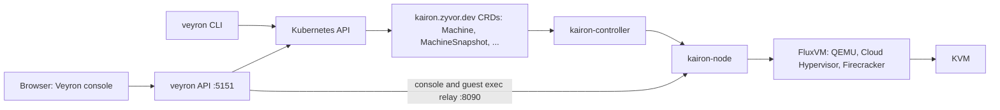

<!-- Copyright 2026 Zyvor AI Labs · https://zyvor.dev -->
<!-- SPDX-License-Identifier: LicenseRef-Zyvor-Production-1.0 -->
# Architecture

Veyron is one Rust binary with three faces: a React console, an HTTPS API and a CLI. It keeps no
database of its own. VM state lives in Kubernetes, and Veyron's own settings (alert rules,
policies, budgets, SOC state) live in labeled ConfigMaps.

## Components

| Component | Role |
|---|---|
| **Console** (`frontend/`) | Vite + React app served at `/console`, embedded in the binary. Light and dark themes in the Zyvor design system. |
| **API** (`src/api/`) | Axum over TLS. Auth (API keys, local accounts, JWT, OIDC), role checks per route, rate limiting, WebSocket console proxy. |
| **CLI** (`src/cli/`, `src/handlers/`) | `veyron create`, `list`, `start`, `snapshot`, `deploy`, `generate` and more, using your kubeconfig. |
| **Kairon** | The VM engine. A `Machine` is desired state; `kairon-controller` places it and `kairon-node` runs it on FluxVM. |

## The console

The top nav groups every page; ⌘K finds any of them. Pages that list large or slow data load only
while they are open, so the 30-second background refresh stays light.

| Group | Pages |
|---|---|
| **Overview** | Mission Control, Consoles, Monitoring, Topology |
| **Compute** | Virtual machines, Hosts, GPUs, Template Foundry, Images & ISOs, Pods, Workloads, Migrations |
| **Storage & Network** | Storage, Snapshots, Snapshot schedules, Backups, Storage health, Orphan volumes (dry-run first, then reclaim), Atlas, DR & Velero, Networks, Cilium, Policies & ingress, Netra, Paqtra |
| **Security** | Alerts, Security (SOC), Threat hunting, Security findings, Compliance, Audit trail, Users & roles |
| **Operations** | Costs (with budgets), Recommendations, SLOs, Incidents, Events, Logs |
| **Platform** | Operators, Helm releases, Namespaces & quotas, GitOps & catalog, Custom resources, Clusters |

Clicking a VM opens its details panel: **Info** (spec plus security checks), **Events**, **Guest**
(agent status, doctor, evidence, fix plan, metrics, migration readiness, filesystems; queried only
when the guest agent is connected) and **Ops** (power, expose, hotplug, disks, data disks, volume
hotplug and per-VM migrations). Admin-only actions such as user management, catalog sync and
orphan reclaim are hidden or disabled for other roles.

## How a VM request flows

1. The console or CLI sends a VM spec: template, CPU, memory, disks, network, cloud-init.
2. Veyron expands the template (`src/templates/`) into a `VMConfig` and lowers it into a Kairon
   `Machine`: resources, image (OCI references resolved to a digest), volumes, port forwards,
   structured cloud-init, and device claims for GPUs.
3. Kairon schedules and runs the Machine. Veyron reads `status.phase`, node, guest IPs and resource
   usage back for the console.
4. Console, serial and guest commands (patching, RDP enable, `fstrim`) go through the kairon-node
   relay on port 8090 with a bearer token, so there is no per-VM pod to exec into.

Features with no Kairon equivalent return `501 Not Implemented` with a JSON reason, rather than
pretending to work.

## Day-2 operations

All of these are API routes, and most are console actions too:

- **Compute:** CPU and memory hotplug, run strategy, bulk start, stop, restart, migrate and delete.
- **Nodes:** cordon and uncordon; drain through migration.
- **Guests:** OS patching with an optional pre-snapshot, disk space reclaim.
- **Self-healing:** dry-run by default; restarts failed VMs with a per-VM cooldown when enabled.
- **Data:** snapshots, restores, clones, backups, orphaned-volume cleanup (dry-run by default),
  storage-class migration, Velero, and Atlas-backed Ceph snapshots and off-cluster backups.
- **Platform:** installed versions, capacity headroom, capability probes
  (`GET /api/v1/platform/capabilities`).

## Source map

| Path | What lives there |
|---|---|
| `src/api/http_server.rs` | Server, TLS, middleware, WebSocket upgrade, console proxy |
| `src/api/handlers/` | One module per API area (VMs, snapshots, SOC, costs, GPUs, ...) |
| `src/api/auth_context.rs` | Minimum role for every route |
| `src/kairon/` | Kairon CRD models, VMConfig to Machine conversion, relay client |
| `src/kube/` | Kubernetes client wrapper and VM queries |
| `src/config/` | `VMConfig` schema and builder, `~/.config/veyron/config.toml` |
| `src/templates/` | OS templates |
| `src/soc/` | Security events, detections, SIEM export |
| `charts/veyron`, `deploy/k8s.yaml` | Helm chart and plain manifests (keep their RBAC in sync) |
