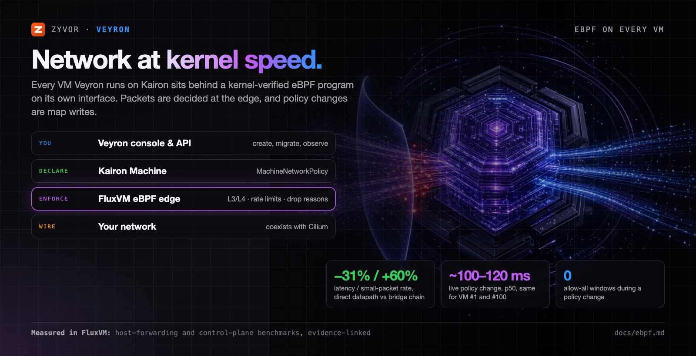

<!-- Copyright 2026 Zyvor AI Labs · https://zyvor.dev -->
<!-- SPDX-License-Identifier: LicenseRef-Zyvor-Production-1.0 -->
# Network at kernel speed: eBPF on every VM

Traditional VM platforms push guest traffic through bridges, veth pairs and long iptables chains. They
often add a Pod per VM on top. Veyron's stack doesn't. Every VM that Veyron runs on
[Kairon](https://github.com/zyvorai/kairon) is a FluxVM guest. FluxVM puts a **kernel-verified eBPF
program on that VM's own network interface**, and the program decides every packet using per-VM maps.

What that means for you:

- **Policy changes are instant and safe.** A change is a map write that takes about 100-120 ms p50 and
  costs the same for your first VM and your hundredth. During the change the edge briefly denies too
  much; it never allows everything.
- **Fewer hops, more packets.** FluxVM's direct datapath cuts the host path from 8 devices to 4. In
  host-forwarding benchmarks that's -31% latency and +60% small-packet rate.
- **Connections survive live migration.** Conntrack moves with the VM and is checked against the
  destination's policy before it is restored.
- **You can see why a packet died.** Drops are attributed to a reason (`spoof_ip`, `dns_deny`,
  `sni_deny`, `rate_limit` and so on), with per-VM flows, stats and one-command packet capture.
- **It works with your CNI.** FluxVM owns only the VM edge and never writes Cilium's maps.

The numbers are FluxVM's published, evidence-linked measurements: host forwarding and control-plane round
trips, not guest throughput. Method and caveats:
[FluxVM eBPF overview](https://github.com/zyvorai/zyvor-fluxvm/blob/main/docs/ebpf.md).

## How the layers fit

| Layer | Role |
|---|---|
| **Veyron** (console, API, CLI) | Creates, migrates and observes VMs |
| **Kairon** `Machine` + `MachineNetworkPolicy` | Declares each VM's network: mode, anti-spoof, guest-IP learning, rate limits, DNS/SNI allow lists |
| **FluxVM** on each node | Enforces it in the TC/eBPF program on the VM's TAP |
| Your network and CNI | Unchanged. Cilium coexists |

Recent FluxVM releases make native eBPF the default dataplane in strict mode. A node needs the BPF
objects installed before upgrading, or an explicit `mode = "legacy"` pin. See
[Kairon: VM-edge eBPF](https://github.com/zyvorai/kairon/blob/main/docs/ebpf-edge.md#requirements).

## What you control today, and where

| Want | Where |
|---|---|
| Anti-spoof, guest-IP learning, QoS, DNS/SNI allow lists | `Machine.spec.network` and `MachineNetworkPolicy` with `kubectl` or GitOps ([Kairon VM edge](https://github.com/zyvorai/kairon/blob/main/docs/ebpf-edge.md)) |
| Flows, attributed drops, packet capture for one VM | `kaironctl network flows`, `drops` or `capture <machine>`, or the Kairon dashboard **Network** panel |
| Kubernetes and Cilium policy inventory, Hubble flows | Veyron `GET /api/v1/network-policies`, `GET /api/v1/cilium/{status,policies,flows}` and the console's **NetworkPolicy** view |
| Drop counters in Prometheus | `kairon_net_drops_total{namespace,machine,reason,policy}` from kairon-node |

Veyron doesn't yet edit the eBPF edge fields itself. They live on the Kairon `Machine`, so GitOps and
`kubectl` changes take effect and Veyron shows the result. The per-VM internet toggle
(`PUT /api/v1/vms/:ns/:name/network/internet`) is a Cilium or Kubernetes NetworkPolicy on the
virt-launcher Pod, so it applies only to the legacy KubeVirt path, not to the eBPF edge.

## Related

- [FluxVM: eBPF dataplane overview](https://github.com/zyvorai/zyvor-fluxvm/blob/main/docs/ebpf.md): packet path, numbers, safety model
- [Kairon: VM-edge eBPF](https://github.com/zyvorai/kairon/blob/main/docs/ebpf-edge.md): fields, status, metrics
- [architecture.md](architecture.md): how Veyron, Kairon and FluxVM fit together
