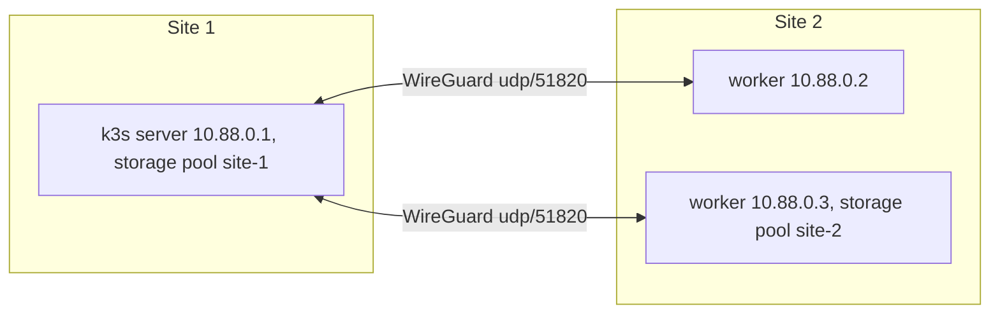

<!-- Copyright 2026 Zyvor AI Labs · https://zyvor.dev -->
<!-- SPDX-License-Identifier: LicenseRef-Zyvor-Production-1.0 -->
# Two racks or two sites

One k3s control plane spanning two racks or sites over a host-level WireGuard underlay, with
storage kept separate per site.



## Design

| Decision | Choice |
|---|---|
| Mesh | Host-level WireGuard, `wg-veyron`, `10.88.0.0/24`. Tailscale with `V9S_MESH_BACKEND=tailscale` |
| Control plane | One server at site 1; never stretch etcd quorum across a WAN |
| CNI | Cilium native routing over the underlay; no double encryption |
| Storage | One pool per site; no stretched Ceph across a WAN |
| Migration | Within a site only. Moving between sites is disaster recovery (Velero or Atlas), never live migration |

## Runbook

```bash
# 1. Make the site-1 server the mesh hub (once)
./scripts/cluster/join-remote-worker.sh --init-server <site1-public-ip> root

# 2. Join each site-2 worker: preflight, WireGuard, peer exchange, MTU check, k3s agent, zone label
V9S_SERVER_HOST=<site1-public-ip> V9S_SITE=site-2 \
  ./scripts/cluster/join-remote-worker.sh <worker-ip> root

# 3. Verify
kubectl get nodes -o wide      # INTERNAL-IP is 10.88.0.x
wg show                        # recent handshakes on both ends
```

Keep VMs inside one site with a zone selector:

```json
{ "name": "web-1", "scheduling": { "node_selector": { "topology.kubernetes.io/zone": "site-2" } } }
```

Use site-suffixed StorageClasses with `allowedTopologies` so volumes bind locally.
`./scripts/cluster/adapt-existing-cluster.sh` warns when nodes span zones but no StorageClass is
zone-aware.

## Troubleshooting

| Symptom | Likely cause |
|---|---|
| No WireGuard handshake | udp/51820 blocked toward the server |
| Node `NotReady` after a handshake | The agent joined on the public IP; `--node-ip` must be the mesh IP |
| Small transfers work, large ones hang | MTU. Lower it to 1380 on both ends |
| A rehearsal VM loses DNS | Its k3s CIDRs collide with the host cluster's; use `10.44.0.0/16`, `10.45.0.0/16` |
